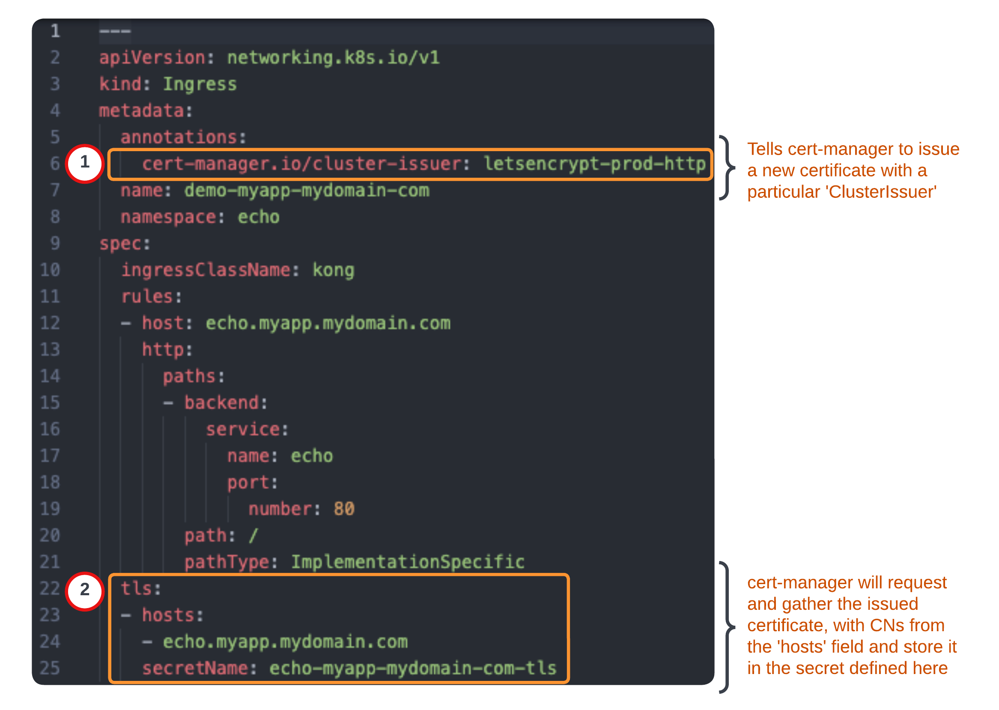

# kong.kong.k4k8s_cert_manager

[](https://github.com/Kong/kong-ansible-collection/actions/workflows/k4k8s_cert_manager-ci.yml)

<p align="center">
  </div>
</p>

## Description

An Ansible role to deploy [cert-manager](https://cert-manager.io) on a Kubernetes or Red Hat OpenShift cluster for the purpose of automated deployment of TLS certificates with Kong Kubernetes Ingress Controller ingresses.  The role can optionally currently deploy a cert-manager `ClusterIssuer` for the [ACME protocol](https://tools.ietf.org/html/rfc8555) via [Let's Encrypt](https://letsencrypt.org/how-it-works/) using either a HTTP01 solver or DNS01 solver.


## Table of Contents


<!-- @import "[TOC]" {cmd="toc" depthFrom=2 depthTo=6 orderedList=true} -->

<!-- code_chunk_output -->

1. [Description](#description)
2. [Table of Contents](#table-of-contents)
3. [Dependencies](#dependencies)
    1. [Python dependencies](#python-dependencies)
    2. [Ansible collection dependencies](#ansible-collection-dependencies)
    3. [Binary dependencies](#binary-dependencies)
4. [Testing and Supported Platforms](#testing-and-supported-platforms)
5. [Default variables](#default-variables)
    1. [Kubernetes and Red Hat OpenShift variables](#kubernetes-and-red-hat-openshift-variables)
    2. [Helm variables](#helm-variables)
    3. [Cert-manager ClusterIssuer global variables](#cert-manager-clusterissuer-global-variables)
        1. [DNS Solver - AWS Route53 integration variables](#dns-solver-aws-route53-integration-variables)
6. [Advanced Variables](#advanced-variables)
    1. [Helm](#helm)
    2. [Cert-manager deployment and configuration](#cert-manager-deployment-and-configuration)
    3. [Collected result variables and other set facts or variables](#collected-result-variables-and-other-set-facts-or-variables)
7. [Playbook usage examples and how-to guide](#playbook-usage-examples-and-how-to-guide)
    1. [Deploy cert-manager with no ClusterIssuer](#deploy-cert-manager-with-no-clusterissuer)
    2. [Deploy cert-manager ACME HTTP01 solver ClusterIssuer configuration](#deploy-cert-manager-acme-http01-solver-clusterissuer-configuration)
    3. [Deploy cert-manager ACME DNS01 solver ClusterIssuer configuration](#deploy-cert-manager-acme-dns01-solver-clusterissuer-configuration)
    4. [Securing Kong Ingresses with cert-manager](#securing-kong-ingresses-with-cert-manager)
    5. [Exposing and Securing Kong Ingresses for Kong Enterprise Services](#exposing-and-securing-kong-ingresses-for-kong-enterprise-services)
8. [License](#license)
9. [Author](#author)

<!-- /code_chunk_output -->


## Dependencies


### Python dependencies

See [requirements.txt](requirements.txt)

Pre-install Python module dependencies with:

```bash
pip3 install -r requirements.txt
```


### Ansible collection dependencies

See [galaxy-requirements.yml](galaxy-requirements.yml)

Pre-install Ansible Galaxy Collection requirements with:

```bash
ansible-galaxy install -r galaxy-requirements.yml
```


### Binary dependencies

1. [Helm3](https://helm.sh/docs/intro/install/) `helm` is required on the target Ansible host (`{{ inventory_hostname }}`) in `$PATH`.


**[Table of Contents](#table-of-contents)**

---


## Testing and Supported Platforms

This Ansible role was validated to function using [`ansible-test`](https://docs.ansible.com/ansible/latest/dev_guide/developing_collections_testing.html) and [this](../../.github/workflows/k4k8s_cert_manager-ci.yml) GitHub Actions workflow.

The testing targets the latest version of Kubernetes available from [`microk8s`](https://microk8s.io/) a fully compliant and lightweight Kubernetes distribution and Red Hat OpenShift using the [`microshift-aio:latest`](https://microshift.io/) container image.

The testing matrix is validated against the following `ansible-test` containers as target hosts and launched from the default `ansible-test` container:

|Test Container|Python Version|
|---|---|
|default|3.10|
|ubuntu1804|3.6|
|ubuntu2004|3.8|
|opensuse15|3.6|


## Default variables

The following tables outline variables available in [defaults/main.yml](defaults/main.yml) and are used to control the behavior of the `kong.kong.k4k8s_cert_manager` Ansible role. They are presented based on how they affect the overall operation of the role's automation.


### Kubernetes and Red Hat OpenShift variables
|Variable name|Description|Variable type|Default value|Required|
|---|---|---|---|---|
|`k4k8s_cm_namespace`|Kubernetes or Red Hat OpenShift namespace to deploy cert-manager to.|string|`"cert-manager"`|yes|
|`k4k8s_kubeconfig`|Path to kubeconfig to use during Kubernetes and Red Hat OpenShift operations.|string|`None` (unset)|no|
|`k4k8s_cluster_context`|The Kubernetes or Red Hat OpenShift context to use within the specified or default kubeconfig|string|`None` (unset)|no|

**[Table of Contents](#table-of-contents)**

---


### Helm variables
|Variable name|Description|Variable type|Default value|Required|
|---|---|---|---|---|
|`k4k8s_cm_helm_chart_values_files`|List of [Helm values files](https://helm.sh/docs/chart_template_guide/values_files/) that modify the deployment of cert-manager. See the available values [here](https://artifacthub.io/packages/helm/cert-manager/cert-manager)|list/array|`[]`|no|
|`k4k8s_cm_helm_chart_values`|Dictionary of Helm values to apply to the cert-manager Helm charts.  See the available values [here](https://artifacthub.io/packages/helm/cert-manager/cert-manager). Can be used with `k4k8s_cm_helm_chart_values_files`, or alone. If combining with `k4k8s_cm_helm_chart_values_files` these values will be applied last and can override values in your `k4k8s_cm_helm_chart_values_files` via recursive dictionary merges and any lists are replaced with the new value. This is a great way to override a single value or a few. See Ansible's [combine filter documentation](https://docs.ansible.com/ansible/latest/user_guide/playbooks_filters.html#combining-hashes-dictionaries) for more clarity on this merge methodology.|dictionary|`{}`|no|
|`k4k8s_cm_helm_chart_values_remote`|Whether or not the `k4k8s_cm_helm_chart_values_files` should be read from the `{{ inventory_hostname }}` or Ansible control node. Set to `true` when the Helm values files are on the remote `{{ inventory_hostname }}`.|boolean|`false`|yes|

**[Table of Contents](#table-of-contents)**

---


### Cert-manager ClusterIssuer global variables

These variables apply when `k4k8s_cm_create_cluster_issuer: true`.

|Variable name|Description|Variable type|Default value|Required|
|---|---|---|---|---|
|`k4k8s_cm_create_cluster_issuer`|Whether or not to deploy a cert-manager `ClusterIssuer`. The current `ClusterIssuer` configurations available with this Kong for Kubernetes integration leverage the [ACME protocol](https://tools.ietf.org/html/rfc8555) via [Let's Encrypt](https://letsencrypt.org/how-it-works/). To learn more about the concept of `Issuer` and `ClusterIssuer` resources, see the cert-manager [Issuer Configuration](https://cert-manager.io/docs/configuration/) documentation.|boolean|`false`|yes|
|`k4k8s_cm_cluster_issuer_config`|Cert-manager must resolve requests for new ACME TLS certificate requests with a "solver".  The certificate `Issuer` or `ClusterIssuer` checks the solver to validate a domain belongs to the requester.  This role currently supports a pre-defined http-based solver for configuration for the ACME protocol that will function with Kong's products, as well as a DNS based solver configuration for AWS Route53 with the ACME protocol.  Use the setting value of `"http_acme"` for the http solver ClusterIssuer configuration.  Use the value of `dns_route53_acme` for the AWS Route53 DNS solver ClusterIssuer configuration.|string|`"http_acme"`|no|
|`k4k8s_cm_cluster_issuer_name`|Name of the `ClusterIssuer` Kubernetes or Red Hat OpenShift resource to create|string|`"letsencrypt-prod"`|no|
|`k4k8s_cm_acme_acct_email_address`|An optional email address to use when requesting certificates via [Let's Encrypt](https://letsencrypt.org/how-it-works/).  This will be used for notifications of expiring certificates.|string|`None` (unset)|no|
|`k4k8s_cm_acme_server`|The ACME protocol Let's Encrypt server to use when requesting TLS certificates.  This is defaulted to Let's Encrypt's production environment.|string|`"https://acme-v02.api.letsencrypt.org/directory"`|no|

**[Table of Contents](#table-of-contents)**

---


#### DNS Solver - AWS Route53 integration variables

These variables apply when `k4k8s_cm_create_cluster_issuer: true` and `k4k8s_cm_solver: "dns_route53"` are set.  Currently this integration is configured to use a programatic AWS IAM user and role with appropriate [Route53 permissions](https://cert-manager.io/docs/configuration/acme/dns01/route53/#set-up-an-iam-role).  While more providers may be added in the future, if you have an immediate need, please file a new [issue](https://github.com/Kong/kong-ansible-collection/issues).  Pull requests are also welcome, if you would like to add in additional functionality.

|Variable name|Description|Variable type|Default value|Required|
|---|---|---|---|---|
|`k4k8s_cm_route53_access_key_id`|Your AWS programatic IAM user access key ID for use with cert-manager.|string|`""`|no|
|`k4k8s_cm_route53_secret_access_key`|Your AWS programatic IAM user secret access key for use with cert-manager.  This will be stored in a Kubernetes or Red Hat OpenShift secret.|string|`""`|no|
|`k4k8s_cm_route53_region`|It is required to specify an AWS region which is used when authenticating to AWS via cert-manager for modifying temporary Route53 records.|string|`""`|no|
|`k4k8s_cm_route53_dns_zones`|List of AWS Route53 DNS hosted zones.  See [DNS Zones](https://cert-manager.io/docs/configuration/acme/#dns-zones) in the cert-manager documentation for more details.|list/array|`[]`|no|

**[Table of Contents](#table-of-contents)**

---


## Advanced Variables

The variables defined in the sections below are available for deeper configuration of the role, and probably will not need to be overridden in most use-cases.


### Helm

| Variable name | Description | Variable type | Default value | Required |
| --- | --- | --- | --- | --- |
|`k4k8s_cm_helm_atomic`|Equivalent to the `helm` `--atomic` option.|boolean|`false`|no|
|`k4k8s_cm_helm_binary_path`|Path to the `helm` executable.|string|`"helm"`|no|
|`k4k8s_cm_helm_chart_ref`|The Helm chart name to use to deploy cert-manager to Kubernetes or Red Hat OpenShift clusters.|string|`"jetstack/cert-manager"`|no|
|`k4k8s_cm_helm_chart_repo_name`|Name to install the Helm chart repository as.|string|`"jetstack"`|no|
|`k4k8s_cm_helm_chart_repo_url`|URL for cert-manager's helm chart repository.|string|`"https://charts.jetstack.io"`|no|
|`k4k8s_cm_helm_chart_repo_username`|Username for helm chart access.|string|`None` (omitted)|no|
|`k4k8s_cm_helm_chart_repo_password`|Password for helm chart access.|string|`None` (omitted)|no|
|`k4k8s_cm_helm_chart_version`|Use if you need a particular cert-manager Helm Chart version, otherwise the latest chart will be used.|string|`None` (unset)|no|
|`k4k8s_cm_helm_disable_hook`|Corresponds to the `helm` `--no-hooks` option.|boolean|`false`|no|
|`k4k8s_cm_helm_force_reinstall`|Helm option to force reinstall, ignore on new install.|boolean|`False`|no|
|`k4k8s_cm_helm_release_name`|Name of the helm release.|string|`"cert-manager"`|no|
|`k4k8s_cm_helm_replace`|Corresponds to the `helm` `--replace` option.|boolean|`false`|no|
|`k4k8s_cm_helm_update_repo`|Whether or not to update the helm chart repository prior to deployment.  This ensures the latest chart is available.  If a specific chart version is required, set the `k4k8s_cm_helm_chart_version`|boolean|`true`|no|
|`k4k8s_cm_helm_wait`|Whether or not to wait for the Helm Chart's objects to be successfully deployed and at desired state.|boolean|`true`|no|

**[Table of Contents](#table-of-contents)**

---


### Cert-manager deployment and configuration

| Variable name | Description | Variable type | Default value | Required |
| --- | --- | --- | --- | --- |
|`k4k8s_cm_crd_install_url`|URL to install the cert-manager CRDs for Kubernetes or Red Hat OpenShift from.|string|`"https://github.com/cert-manager/cert-manager/releases/download/{{ k4k8s_cm_helm_chart_version }}/cert-manager.crds.yaml"`|no|
|`k4k8s_cm_crd_names`|Used to perform an idempotency check to verify if the cert-manager CRDs have already been installed on the cluster.|list/array|see [vars/main.yml](https://github.com/Kong/kong-ansible-collection/blob/main/roles/k4k8s_cert_manager/vars/main.yml)|no|
|`k4k8s_cm_route53_secret_name`|Name of the Kubernetes or Red Hat OpenShift secret to store the AWS Route53 `k4k8s_cm_route53_secret_access_key` in.|string|`"aws-route53-secret-access-key"`|no|
|`k4k8s_cm_route53_secret_access_key_key`|Name of the dictionary key within the `k4k8s_cm_route53_secret_name` secret to store the `k4k8s_cm_route53_secret_access_key` data in.|string|`"aws-secret-access-key"`|no|

**[Table of Contents](#table-of-contents)**

---


### Collected result variables and other set facts or variables

The following table of variables may be useful for debugging purposes.  You can access them after the `kong.kong.k4k8s_cert_manager` role has completed its run.  If running the `kong.kong.k4k8s_cert_manager` role via `ansible.builtin.include_role` you will need to add `public: True` to the module parameters, which allows you to access role variables after they have completed running.

|Variable name|Description|
|---|---|
|`__k4k8s_cm_helm_results__`|The results collected from applying the cert-manager Helm chart via the `kubernetes.core.helm` Ansible module|
|`__k4k8s_cm_helm_release_values__`|The combined values from your helm values files and helm values.  This is what gets applied during Helm chart deployment.  Good way to validate your chart values are being read as you expect them to. |

**[Table of Contents](#table-of-contents)**

---


## Playbook usage examples and how-to guide


### Deploy cert-manager with no ClusterIssuer

```yaml
---
- name: "Ensure cert-manager is deployed for Kong"
  hosts: "localhost"
  tasks:
    - name: "Ensure cert-manager is deployed with no ClusterIssuer"
      ansible.builtin.include_role:
        name: "kong.kong.k4k8s_cert_manager"
      vars:
        k4k8s_kubeconfig: "/path/to/my/cluster/kubeconfig"
```


### Deploy cert-manager ACME HTTP01 solver ClusterIssuer configuration

```yaml
---
- name: "Ensure cert-manager is deployed for Kong with ACME HTTP01 solver ClusterIssuer"
  hosts: "localhost"
  tasks:
    - name: "Ensure cert-manager is deployed with ACME HTTP01 solver ClusterIssuer"
      ansible.builtin.include_role:
        name: "kong.kong.k4k8s_cert_manager"
      vars:
        k4k8s_kubeconfig: "/path/to/my/cluster/kubeconfig"
        k4k8s_cm_create_cluster_issuer: true
        k4k8s_cm_acme_acct_email_address: "myemail@mydomain.com"
        k4k8s_cm_cluster_issuer_config: "http_acme"
        k4k8s_cm_cluster_issuer_name: "letsencrypt-prod-http"
        k4k8s_cm_acme_server: "https://acme-v02.api.letsencrypt.org/directory"
```


### Deploy cert-manager ACME DNS01 solver ClusterIssuer configuration

```yaml
---
- name: "Ensure cert-manager is deployed for Kong with ACME DNS01 solver ClusterIssuer"
  hosts: "localhost"
  vars_files:
    - /path/to/my/ansible_vault.yml
  tasks:
    - name: "Ensure cert-manager is deployed with ACME DNS01 solver ClusterIssuer"
      ansible.builtin.include_role:
        name: "kong.kong.k4k8s_cert_manager"
      vars:
        k4k8s_kubeconfig: "/path/to/my/cluster/kubeconfig"
        k4k8s_cm_create_cluster_issuer: true
        k4k8s_cm_acme_acct_email_address: "myemail@mydomain.com"
        k4k8s_cm_cluster_issuer_config: "dns_route53_acme"
        k4k8s_cm_cluster_issuer_name: "letsencrypt-prod-dns"
        k4k8s_cm_acme_server: "https://acme-v02.api.letsencrypt.org/directory"
        k4k8s_cm_route53_access_key_id: "{{ access_key_id_from_ansible_vault }}"
        k4k8s_cm_route53_secret_access_key: "{{ secret_access_key_id_from_ansible_vault }}"
        k4k8s_cm_route53_region: "us-east-1"
        k4k8s_cm_route53_dns_zones:
          - "demo.mydomain.com"
          - "mydomain.com"
          - "another.domain.com"
```

### Securing Kong Ingresses with cert-manager

Now that you've deployed cert-manager with one of the examples above, it's time to deploy some TLS certificates.

Requirements:
  * A `ClusterIssuer` must first be available on the Kubernetes or Red Hat OpenShift cluster.  You can deploy one with this Ansible Role.  See the examples above on how to do this.

1. Edit one of your existing Kong `Ingress` resources and add the annotation `cert-manager.io/cluster-issuer: "letsencrypt-prod"`.  The value of the `cert-manager.io/cluster-issuer` must match one of your `ClusterIssuer`s `metadata.name`.  The default name of the `ClusterIssuer` deployed with this Ansible role is `letsencrypt-prod`.  If you changed your `ClusterIssuer`'s name with the `k4k8s_cm_cluster_issuer_name` variable, then the annotation must match the name of your `ClusterIssuer`.  You can find a full list of supported cert-manager annotations [here](https://cert-manager.io/docs/usage/ingress/#supported-annotations).

1. Your Kong `Ingress` will have a few other fields filled that not only tell Kong Ingress Controller how to operate, but also relate to cert-manager's request process:


1. Once the changes are applied to the Kong `Ingress` cert-manager will automatically deploy a TLS certificate.


### Exposing and Securing Kong Ingresses for Kong Enterprise Services

If you make use of the `kong.kong.k4k8s_deploy` role to deploy your Kong Enterprise instances, then you can easily deploy Kong Ingresses with cert-manager certificates.  Here's a simple way to do it without needing to modify a refined Helm values file:

```yaml
- name: "Ensure cert-manager is deployed for Kong with ACME DNS01 solver ClusterIssuer"
  hosts: "localhost"
  vars_files:
    - /path/to/my/ansible_vault.yml
  vars:
    ingress_dns_zone: "example.com"
    k4k8s_cm_cluster_issuer_name: "letsencrypt-prod-http"
  tasks:
    - name: "Ensure cert-manager is deployed to kong control-plane cluster"
      ansible.builtin.include_role:
        name: "kong.kong.k4k8s_cert_manager"
      vars:
        k4k8s_kubeconfig: "/path/to/my/cluster/kubeconfig"
        k4k8s_cm_create_cluster_issuer: true
        k4k8s_cm_acme_acct_email_address: "myemail@mydomain.com"
        k4k8s_cm_cluster_issuer_config: "http_acme"
        k4k8s_cm_acme_server: "https://acme-v02.api.letsencrypt.org/directory"

    - name: "Ensure kong control-plane is present and configured"
      ansible.builtin.include_role:
        name: "kong.kong.k4k8s_deploy"
      vars:
        k4k8s_kubeconfig: "/path/to/my/cluster/kubeconfig"
        k4k8s_deploy_create_enterprise_superuser_password_secret: true
        k4k8s_deploy_enterprise_license_json_string: "{{ kong_enterprise_license_from_vault }}"
        k4k8s_deploy_enterprise_superuser_password: "{{ kong_enterprise_admin_pass_from_vault }}"
        k4k8s_deploy_create_postgres_password_secret: true
        k4k8s_deploy_postgres_admin_password: "{{ pgsql_admin_pass_from_vault }}"
        k4k8s_deploy_postgres_user_password: "{{ pgsql_user_pass_from_vault }}"
        k4k8s_deploy_create_hybrid_mode_cp_cert_secret: true
        k4k8s_deploy_create_admin_gui_sessions_conf_secret: true
        k4k8s_deploy_admin_gui_sessions_settings:
          cookie_domain: ".{{ ingress_dns_zone }}"
          cookie_name: "oatmeal-raisin"
          cookie_samesite: "off"
          cookie_secure: true
          secret: "thisisverysecret"
        k4k8s_deploy_create_portal_sessions_conf_secret: true
        k4k8s_deploy_portal_sessions_settings:
          cookie_domain: ".{{ ingress_dns_zone }}"
          cookie_name: "chocolate-chip"
          cookie_samesite: "off"
          cookie_secure: true
          secret: "thisisreallysecret"
        k4k8s_deploy_helm_chart_values_files:
          - "kong-enterprise-values.yaml"
        # the following lets us recycle a common helm values file for multiple kong environments
        k4k8s_deploy_helm_chart_values:
          admin:
            ingress:
              tls: "admin-{{ ingress_dns_zone | regex_replace('\\.', '-') }}-tls"  # produces a certificate secret with name admin-example-com-tls
              hostname: "admin.{{ ingress_dns_zone }}"  # produces a hostname of admin.example.com
              annotations:
                cert-manager.io/cluster-issuer: "{{ k4k8s_cm_cluster_issuer_name }}"  # adds the ClusterIssuer annotation to the Kong Ingress
          manager:
            ingress:
              tls: "manager-{{ ingress_dns_zone | regex_replace('\\.', '-') }}-tls"
              hostname: "manager.{{ ingress_dns_zone }}"
              annotations:
                cert-manager.io/cluster-issuer: "{{ k4k8s_cm_cluster_issuer_name }}"
          portal:
            ingress:
              tls: "portal-{{ ingress_dns_zone | regex_replace('\\.', '-') }}-tls"
              hostname: "portal.{{ ingress_dns_zone }}"
              annotations:
                cert-manager.io/cluster-issuer: "{{ k4k8s_cm_cluster_issuer_name }}"
          portalapi:
            ingress:
              tls: "portalapi-{{ ingress_dns_zone | regex_replace('\\.', '-') }}-tls"
              hostname: "portalapi.{{ ingress_dns_zone }}"
              annotations:
                cert-manager.io/cluster-issuer: "{{ k4k8s_cm_cluster_issuer_name }}"
```

In the example above, you will need to create a CNAME DNS record pointing to your Kong proxy service's `LoadBalancer` IP for each of the hostname's in `k4k8s_deploy_helm_chart_values`.  This can be achieved automatically with further automation or [external-dns](https://github.com/kubernetes-sigs/external-dns) running on your cluster and configured for your DNS provider.  

This, of course, is a more advanced sample and much of this is dependent on your Helm values file settings.  Much of your focus should be on what's being done with the `k4k8s_deploy_helm_chart_values` variable, which will override settings within the `k4k8s_deploy_helm_chart_values_files`, creating Kong `Ingress` resources with cert-manager annotations.

---
**[Table of Contents](#table-of-contents)**


## License

[Apache 2.0](https://github.com/Kong/kong-ansible-collection/blob/main/LICENSE)


## Author

[Andrew J. Huffman](https://github.com/ahuffman)

**[Table of Contents](#table-of-contents)**
